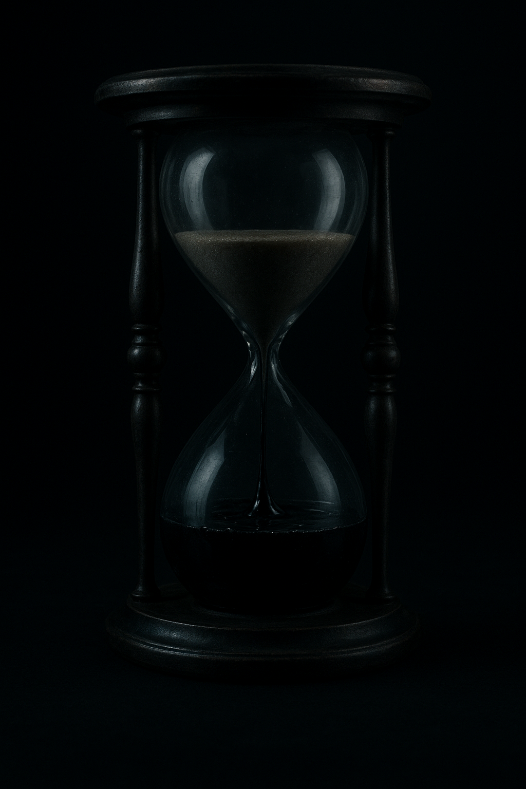
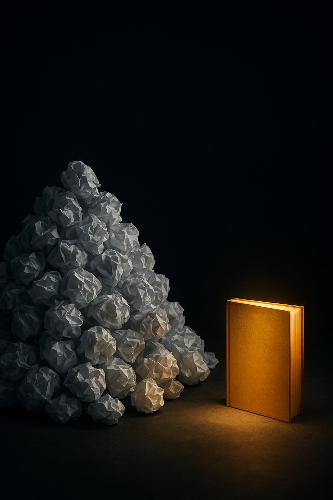

# MindFrame Thumbnail Design Specification

MindFrame thumbnails are designed to be high-contrast, minimalist, and "scroll-stopping." They use the "High-Performance Noir" aesthetic.

## 1. Technical Dimensions
*   **YouTube Shorts / TikTok / Reels:** 1080 x 1920 pixels (9:16).
*   **Safe Zones:** Keep all text and key visual elements within the center 70% of the canvas to avoid UI elements (Follow button, caption, music info).

## 2. Brand Color Palette
*   **Charcoal / Black (#000000, #1A1A1A):** Background and depth.
*   **Gold (#DAA520):** Accent for "Core Truth" text or glowing visual elements.
*   **White (#FFFFFF):** Primary text color for maximum contrast.

## 3. Typography Specs
*   **Primary Font:** **Montserrat Extra Bold** or **Archivo Black**.
*   **Style:** All Caps.
*   **Shadow:** Heavy black drop shadow (40-60% opacity) to ensure readability over varied B-roll.
*   **Highlighting:** Use a Gold box behind critical keywords (e.g., "LIE," "SYSTEM," "SOVEREIGNTY").

## 4. Visual Composition Rules
*   **The "Rule of Contrast":** Light should hit the subject from the side, creating deep shadows.
*   **Subject Matter:** Focus on textures—marble, ink, old metal, mountain ridges, human eyes.
*   **Simplicity:** No more than 3 visual elements per thumbnail.

## 5. Mockup Concepts (Batch 01)
Below are 5 high-fidelity mockups generated to guide the production process:

### Concept 1: The Morning Protocol
*   **Visual:** Morning light hitting a notebook and analog clock.
*   **Overlay:** "OWN YOUR MORNING"
*   

### Concept 2: The Salary Trap
*   **Visual:** Golden handcuffs on a laptop.
*   **Overlay:** "THE GOLDEN TRAP"
*   

### Concept 3: 100% Focus (Deep Work)
*   **Visual:** Individual at desk with a golden shield/aura.
*   **Overlay:** "100% FOCUS"
*   

### Concept 4: Escape the Zone
*   **Visual:** Hourglass filled with black sludge.
*   **Overlay:** "ESCAPE NOW"
*   

### Concept 5: Output Only
*   **Visual:** Mountain of paper vs. one gold book.
*   **Overlay:** "OUTPUT > POTENTIAL"
*   
